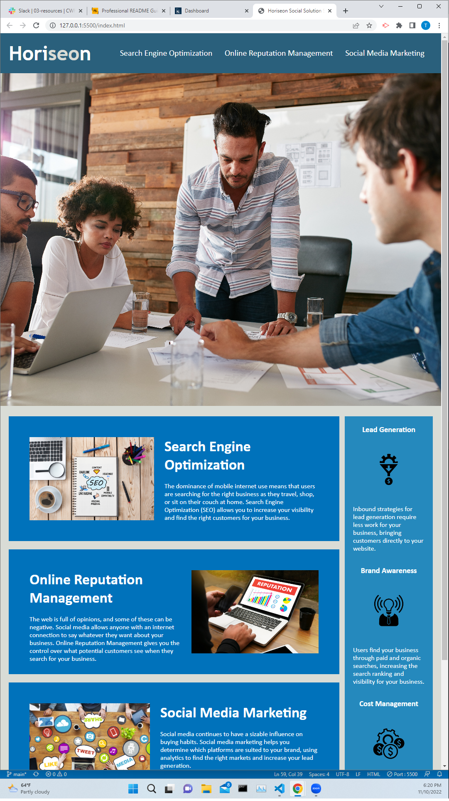

Playing with Semantics and Rounding the edges.

Motivation:
The goal of this challenge was to take the source code and make it more readily accessible to user with higher needs than ordinary and more likely to be pinged on a search engine.

This challenge also set out to teach me to properly order, consolidate, and annotate code in an efficient way.

Why It Was Needed:
This code produced a good website, but with the work done, it now also fits a good semantic profile, is more readily available when searched, and is more readily useable when found.

Problems This Challenge Solved:
Taught me how to look at code and parse what could and could not be consolidated, what each portion of the code was directed toward on the live site, and how to correctly label each point of code in the index.HTML file.

```md
    
    ```
[Finished website URL](https://thoufty.github.io/Challenge-1/)
